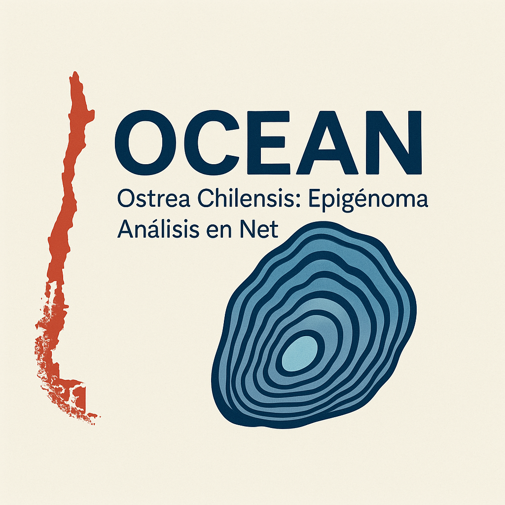

Ostrea chilensis: Epigénoma Análisis en Net
is an integrated web platform dedicated to advancing research on *Ostrea chilensis*, the Chilean flat oyster. By combining high-resolution
genomic data with cutting-edge epigenomic insights, OCEAN supports
researchers exploring gene regulation, environmental plasticity, and
resilience in this ecologically important marine species.

::: {style="text-align: center; font-size: 1.5em; margin-top: 2em;"}
¡Diviértete explorando el océano!
:::

{fig-align="center"
width="450px"}

::: {style="display: flex; align-items: center; gap: 1em;"}
[👉 <a href="jbrowse/index.html">Explore JBrowse Genome
Browser</a>]{style="font-size: 1.1em;"}

:::

For questions or feedback, please submit an issue, [please submit an
issue](https://github.com/RobertsLab/OCEAN/issues/new/choose) 🧬